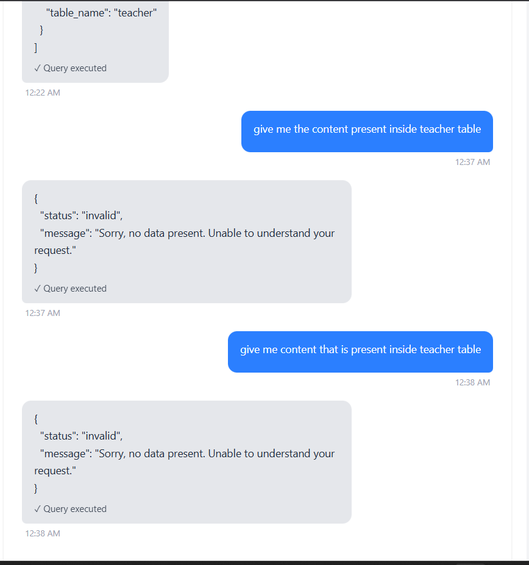
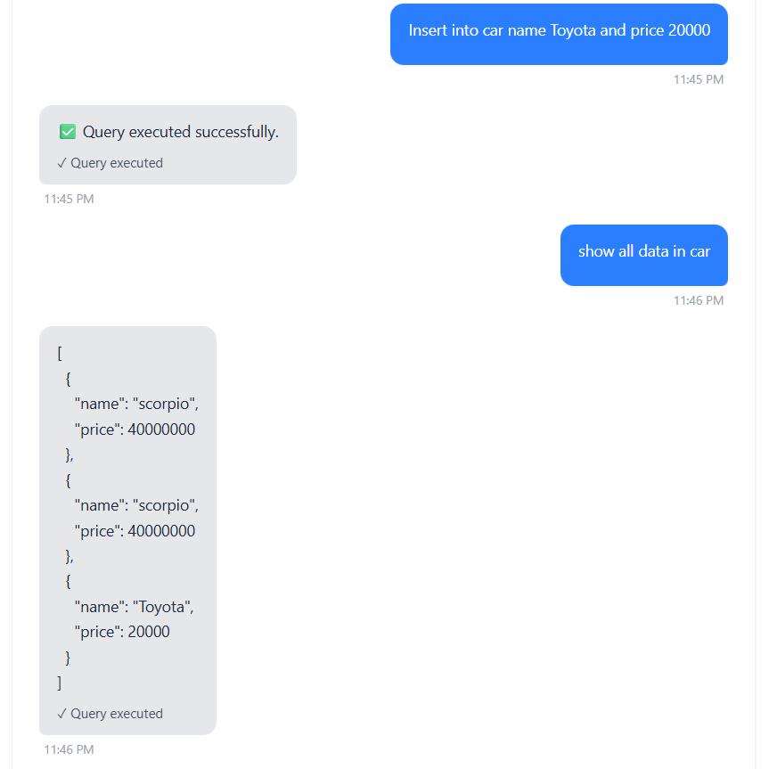
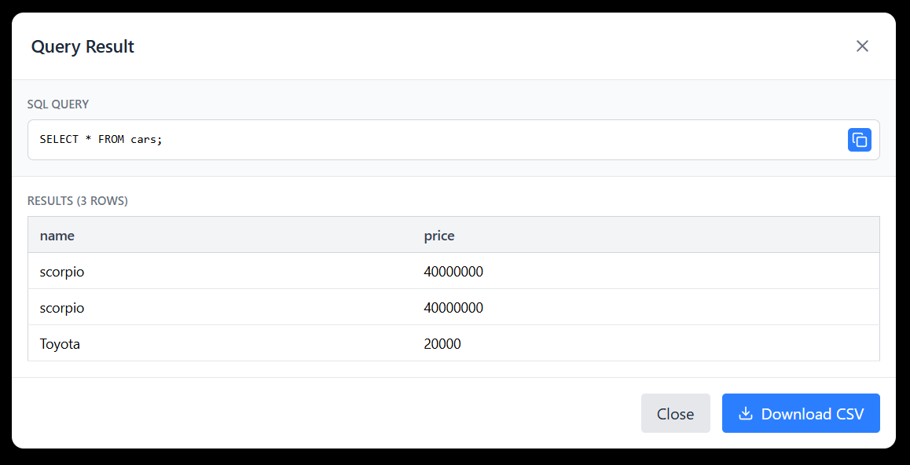

Here’s a clean, short, professional README for your project 👇

---

# 🧠 Natural Language Database Assistant

An AI-powered system that allows users to interact with PostgreSQL databases using natural language instead of SQL.

Users can create a personal database and query it using plain English. The system converts natural language → SQL → executes safely → returns structured results.

---

# 🏗 Architecture Overview

## 🔹 1. Frontend (React + Tailwind)

* React SPA (Vite)
* JWT-based authentication
* Database selector (1 DB per user in dev mode)
* Chat-style interface
* Query result modal (table + CSV export)
* Mutation confirmation modal

**Flow:**

User → Chat Input → `/query` API → Render Result

---

## 🔹 2. Backend (FastAPI)

FastAPI REST API with:

* JWT Authentication
* Database creation endpoint
* Natural language query endpoint
* Confirmation handling for mutations
* Error middleware + structured logging (Loguru)

### Main Endpoints

| Endpoint     | Purpose                    |
| ------------ | -------------------------- |
| `/auth/*`    | Login / Register           |
| `/databases` | Create & fetch user DB     |
| `/query`     | Convert NL → SQL → Execute |

---

## 🔹 3. LLM Layer (Ollama – Phi3)

Used for:

* Converting natural language → PostgreSQL SQL
* Strict SQL-only generation
* No explanations, no markdown
* Temperature = 0.1 for deterministic output

---

## 🔹 4. RAG (Retrieval-Augmented Generation)

Uses:

* LangChain
* FAISS vector store
* Schema embeddings

### Purpose:

* Store database schema as embeddings
* Retrieve relevant schema context before SQL generation
* Reduce hallucination
* Improve table understanding

---

## 🔹 5. Safety Layer

### Multi-layer validation:

1. Check SQL intent
2. Validate table existence
3. Detect mutation queries
4. Require explicit confirmation
5. Execute inside transaction

Mutation flow:

```
User → LLM generates INSERT/UPDATE/DELETE
→ Backend returns "confirmation_required"
→ User approves
→ Query executed
```

---

## 🔹 6. Database Architecture (Dev Mode)

* 1 User → 1 PostgreSQL Database
* Database name stored in `User.database_name`
* Schema introspected dynamically
* Table names fetched using SQLAlchemy inspector

---

# 🔄 Full Request Flow

```
User Question
     ↓
Retrieve Schema (FAISS)
     ↓
Generate SQL (LLM)
     ↓
Validate SQL
     ↓
If mutation → Ask confirmation
     ↓
Execute Query
     ↓
Return structured result
```

---

# 🛡 Design Principles

* No raw SQL from user
* No automatic destructive execution
* Schema-aware generation
* Deterministic LLM behavior
* Clear error handling
* Modular architecture

---

# 📸 ScreenShots






---

# 🚀 Future Improvements

* Multi-database per user (production mode)
* Fuzzy table matching
* Schema auto-reindexing
* Query history
* Role-based access
* Streaming LLM responses

---

